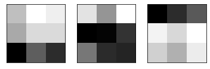
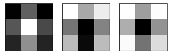
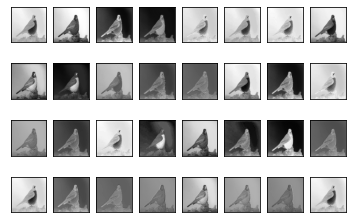
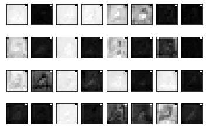

# Visualizaing Filters and Inner Layer Feature Maps

This notebook primarily follows the instructions from machinelearningmastery you can check out the original blog.

Deep learning neural networks are generally opaque, meaning that although they can make useful and skillful predictions, it is not clear how or why a given prediction was made.

Convolutional neural networks, have internal structures that are designed to operate upon two-dimensional image data, and as such preserve the spatial relationships for what was learned by the model. Specifically, the two-dimensional filters learned by the model can be inspected and visualized to discover the types of features that the model will detect, and the activation maps output by convolutional layers can be inspected to understand exactly what features were detected for a given input image.

---

In this project, I tried to visualize pre-trained Xception model's Filters and Feature maps.

## Visualize Filter

Feature Visualization translates the internal features present in an image into visually perceptible or recognizable image patterns. Feature visualization will help us understand the learned features explicitly. You can see the result of Xception model's filters by refering to "How to visualize filters" stage

|block14_sepconv2 (3, 3, 1024, 1)    |block13_sepconv2 (3, 3, 728, 1)|
:-------------------------:|:-------------------------:
|

## How to Visualize Feature Maps

The activation maps in convolutional neural networks, called feature maps, capture the result of applying the filters to input, such as the input image or another feature map.

The idea of visualizing a feature map for a specific input image would be to understand what features of the input are detected or preserved in the feature maps. The expectation would be that the feature maps close to the input detect small or fine-grained detail, whereas feature maps close to the output of the model capture more general features (As we explore the filters in previous part, we observed this fact but in this stage, we are going to investigate it on a real picture).

|First Feature Map    |Last Feature Map|
:-------------------------:|:-------------------------:
|
